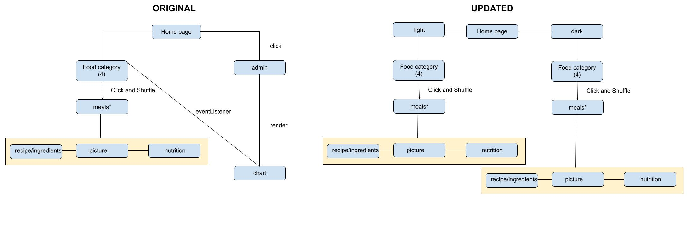

# Recipe Roulette

Team oakFive: Jessi Velasquez, Daniel Dills, Elijah Prom, Simone Odegard, R. Mal Sweet

Our website produces a randomized meal recipe from user selected categories, providing multiple options to, if nothing else, help a user narrow down what appeals to their appetite given day.

## Project Management - Google Docs
[Flow Doc](https://drive.google.com/drive/u/0/folders/143-UD9MiFSvMKEYubOhiYTRwjHS9M33b)

## Software Requirements
[Software Requirements](Requirements.md)

## Wireframe

[Image link](https://docs.google.com/drawings/d/12drTVfVIRcxuTuYoieGvOaehgMqFvPL2m_9P0I8xZKA/edit)
---

---

## Domain Modeling

---

## Sources

[Background Image](https://www.amazon.com/Laminated-24x36-inches-Poster-Background/dp/B076ZX2LSJ)

[A Family Feast](https://www.afamilyfeast.com/)

[Taste of Home](https://www.tasteofhome.com/)

[BellyFull](https://bellyfull.net/)

[Isabel Eats](https://www.isabeleats.com/)

[All Recipes](https://www.allrecipes.com/)

[Delish](https://www.delish.com/cooking/)

[Simply Recipes](https://www.simplyrecipes.com/)

[The Kitchn](https://www.thekitchn.com/)

[Side Chef](https://www.sidechef.com/recipes/)

[Yummly](https://www.yummly.com/)

[Taste of Home](https://www.tasteofhome.com/)

[BBC Good Food](https://www.bbcgoodfood.com/recipes/)

[Learning to Smoke](http://www.learningtosmoke.com/)

[Anna Har](http://www.annahar.com/)

[Taco Bell](http://tacobell.com/)

[I Stock Photo](http://www.istockphoto.com/)
